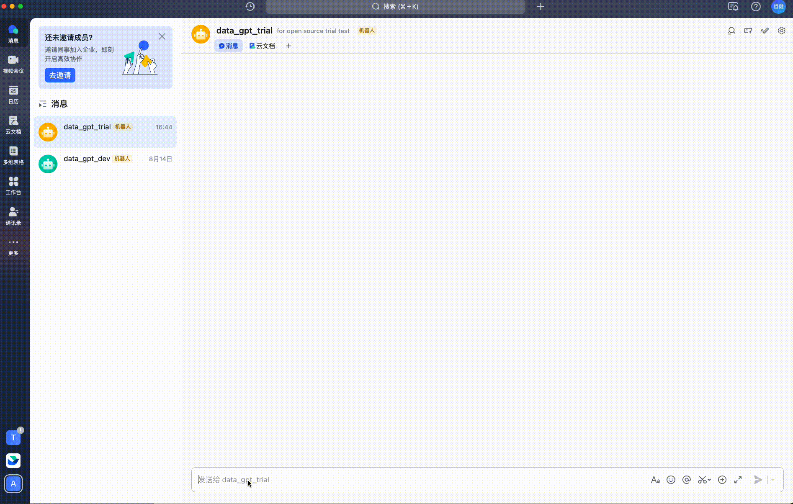
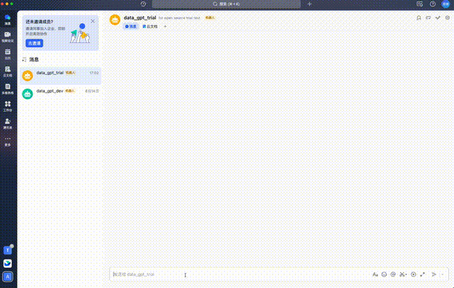
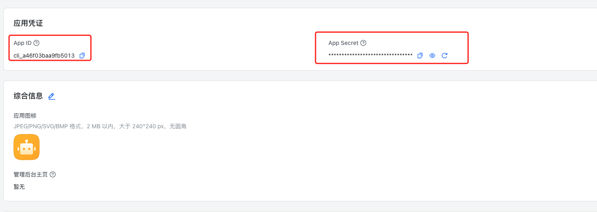
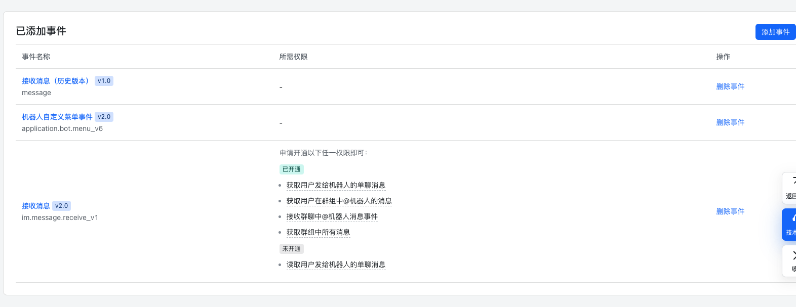
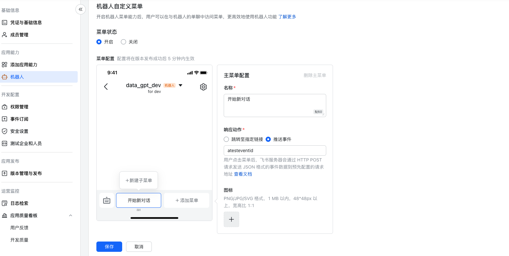

# Feishu DataGPT (Code Interpreter)

Welcome to Feishu DataGPT, a Code Interpreter integration with Feishu. This project attempts to seamlessly integrate [Code Interpreter](https://github.com/shroominic/codeinterpreter-api) into the Feishu platform. In this demo, we leverage a non-open source [Codebox](https://github.com/shroominic/codebox-api/tree/main) for executing Python code. Future updates will include our in-house Codebox.

## Demo

Our integration offers interactive capabilities within Feishu documents (ensure your bot has the necessary permissions). It also supports document and file uploads.

### Interaction with Feishu Docs


### Creating Python Plots


## Deploying the Server with Docker

### Environment Configuration

### Launching Docker
```shell
docker-compose -f docker_dev.yml build
docker-compose -f docker_dev.yml up
```

## Deploying the Feishu Bot and API

1. Using the [Feishu Open Platform](https://open.feishu.cn/app/), create a custom enterprise app.
2. Add the app capability: Bot.
3. In the permission management section, grant all permissions in "Messages & Groups" and "Cloud Docs."
4. Configure the request URL in Event Subscriptions. Add the event: Receive Message `im.message.receive_v1`.
5. Search for and use the app in Feishu after publishing.

App Credentials:


Adding a Clear Session Button:



Feel free to explore our Feishu DataGPT integration further. If you have any questions or need assistance, please don't hesitate to reach out.
